# Buddy - AI Personal Companion by Samsan Tech 
Team Members: 1. Muhammad Fareed Bin Ezani,
              2. Nurain Batrissya Binti Yahya,
              3. Natasya Binti Roslan,
              4. Syakir Zufayrin Bin Khairul Faizal 
Problem Statement: Stress & Workload Manager 
Video Presentation: https://youtu.be/nAUp9JYwCXA?si=tauQnu1D3smdBvvJ   
Presentation Slides: https://canva.link/k6jdch8m6k3kao4 

# 1 - Project Overview

The Problem
University students often have to balance multiple responsibilities at once, including assignments, classes, part-time work, social commitments, errands, and personal time. When these commitments accumulate, students may struggle to recognize that their overall workload has become too heavy, increasing the risk of stress and burnout.

Existing productivity tools such as Notion and calendar applications are useful for organizing tasks, schedules, and deadlines, but they primarily focus on what needs to be done and when. They do not clearly show how different commitments contribute to a student's overall workload or which areas of life are becoming overloaded. Visual planning tools such as Tiimo focus more on routines and scheduling rather than helping students understand their overall capacity.

Our Solution
Buddy is an AI-powered personal companion and capacity manager for students. designed to help students understand, rebalance, and recover from overwhelming workloads. Instead of simply managing tasks, Buddy estimates the impact of a student's commitments across five load dimensions: Mental, Time, Physical, Social, and Errands. These loads are converted into an estimated daily capacity, allowing students to see how much they can realistically carry and make better decisions about their commitments. Buddy also encourages recovery and social support, helping students carry less before their workload becomes overwhelming.

Key Features
1) Brain Dump Input: Zero-friction logger allowing students to drop unstructured thoughts via voice, text, image, or link without manual tagging.   
2) Daily Battery & Load Breakdown: Simple visual UI displaying total energy levels alongside percentage bars across all 5 life pillars.   
3) My Day / Calendar & Load Balancer: Displays commitments with energy impact scores (e.g., -12%), allowing students to dynamically rebalance, push back, or drop tasks when overloaded.   
4) Buddy Club & Buddy Rescue: Non-competitive squad dashboard for tracking peer battery levels and sending care prompts when a friend is struggling.   
5) Daily Reset Wheel: Interactive recovery tool suggesting instant, low-effort recharge activities (e.g., "Touch grass", "2-min breathing").

# 2 - Ideation & Process
## 2.1 - Ideas We Considered

| Idea | Decision & Rationale |
|---|---|
| **Brain Dump** |  **Chosen** - Eliminates the friction of manual task entry by allowing students to unload thoughts through voice, text, images, or links before organizing them. |
| **Daily Battery** |  **Chosen** - Uses a familiar battery metaphor to represent remaining daily capacity, making workload easier to understand at a glance. |
| **Load Breakdown (5 Dimensions)** |  **Chosen** - Visualizes workload across Mental, Time, Physical, Social, and Errands, helping students identify *why* they feel overloaded. |
| **My Day + Load Balancer** |  **Chosen** - Allows students to rebalance their schedule by moving, delaying, or dropping commitments while updating their remaining capacity. |
| **Buddy Club & Buddy Rescue** |  **Chosen** - Creates a non-competitive support system where friends can encourage recovery instead of comparing productivity. |
| **Daily Reset Wheel** |  **Chosen** - Provides quick, low-effort recovery activities for students when their capacity becomes low. |
| **Face Scanner for Burnout Detection** |  **Dropped** - Camera-based burnout detection was considered unreliable, raised privacy concerns, and could not accurately measure emotional wellbeing. |
| **Battery Forecast** |  **Dropped** - Predicting future energy levels required too many assumptions about user behaviour, reducing accuracy and feasibility for the MVP. |
| **Email Auto-Import** |  **Deferred** - Automatically importing assignments from email was valuable, but considered a future enhancement rather than a core launch feature. |
| **Points / XP & Leaderboards** |  **Dropped** - Competitive gamification conflicted with Buddy’s recovery-first philosophy and could increase pressure rather than reduce it. |
| **Daily Streaks** |  **Dropped** - Missing a streak could create guilt and anxiety, making the experience less supportive for students already feeling overwhelmed. |

| Design Idea | Decision & Rationale |
|---|---|
| **Battery as the main visual** |  **Chosen** - A familiar battery metaphor makes remaining capacity immediately understandable without requiring users to interpret complex data. |
| **5 Load Dimensions** |  **Chosen** - Mental, Time, Physical, Social, and Errands provide a simple way to understand what is contributing to overall workload. |
| **Floating Battery Button** |  **Chosen** - Keeps the user's capacity visible and accessible throughout the main experience without taking up permanent screen space. |
| **Minimal, warm visual style** |  **Chosen** - A calm interface was selected to make Buddy feel supportive rather than like another stressful productivity tool. |
| **Recovery-first interactions** |  **Chosen** - Recovery actions are intentionally simple and low-effort so users are not given another demanding task to complete. |
| **Competitive leaderboards** |  **Dropped** - A competitive visual design conflicted with Buddy's goal of reducing pressure and supporting wellbeing. |
| **Complex data visualizations** |  **Dropped** - Radar charts and dense dashboards were avoided because they increase cognitive load when users are already overwhelmed. |

## 2.2 - Ideation Boards

Early Sketches

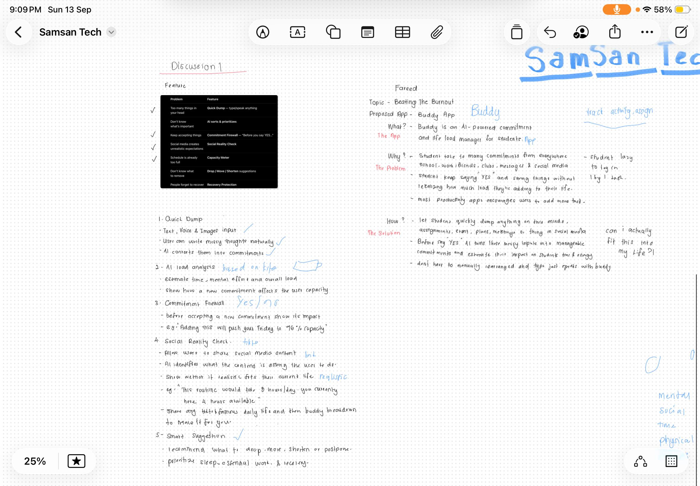

*Initial rough exploration of Buddy's interface and possible feature directions.*

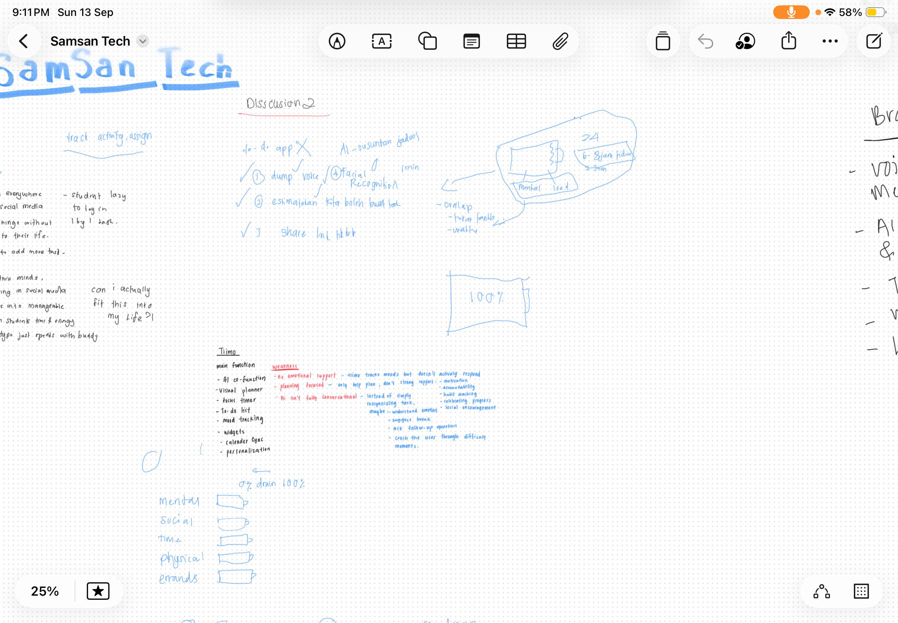

*Early exploration of the battery and workload concept.*

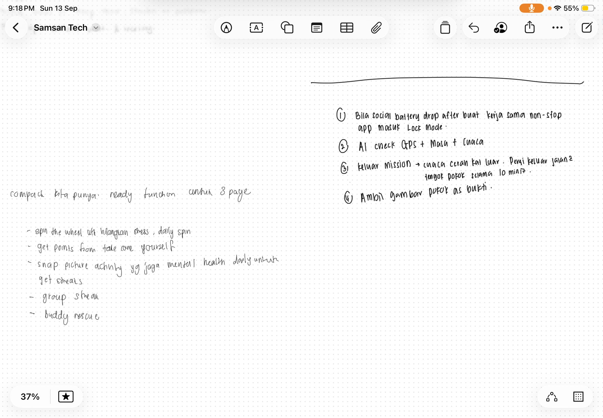

*Additional rough ideas explored during the early ideation stage.*

Mind Maps

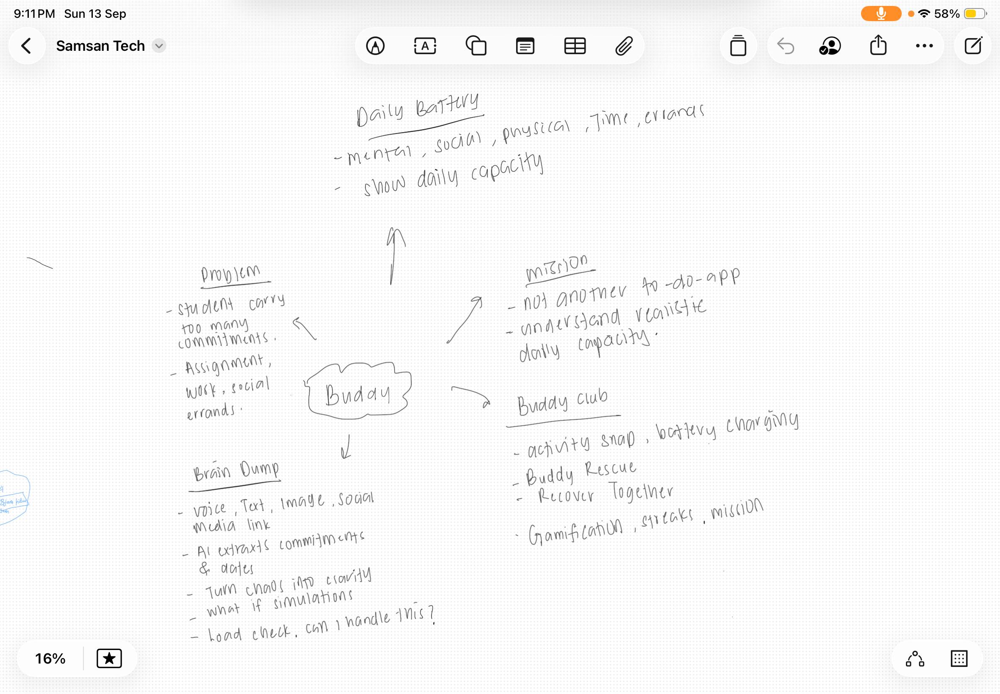

*Initial exploration of the student burnout problem, including workload, stress, responsibilities, and possible solution directions.*

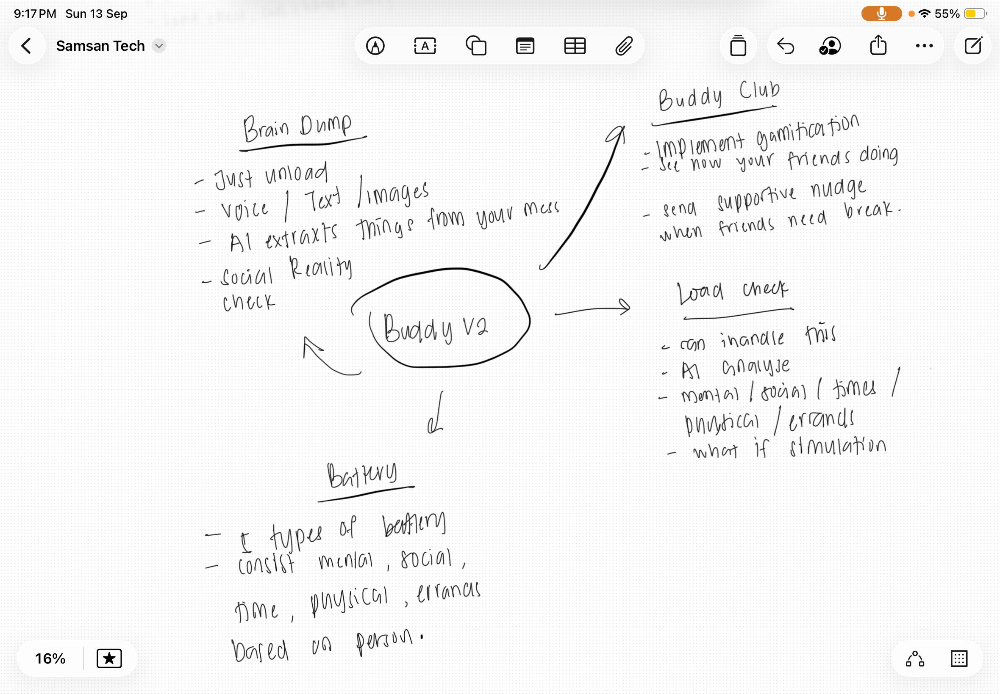

*Further development of potential Buddy features and ways to differentiate the product.*

User Flow

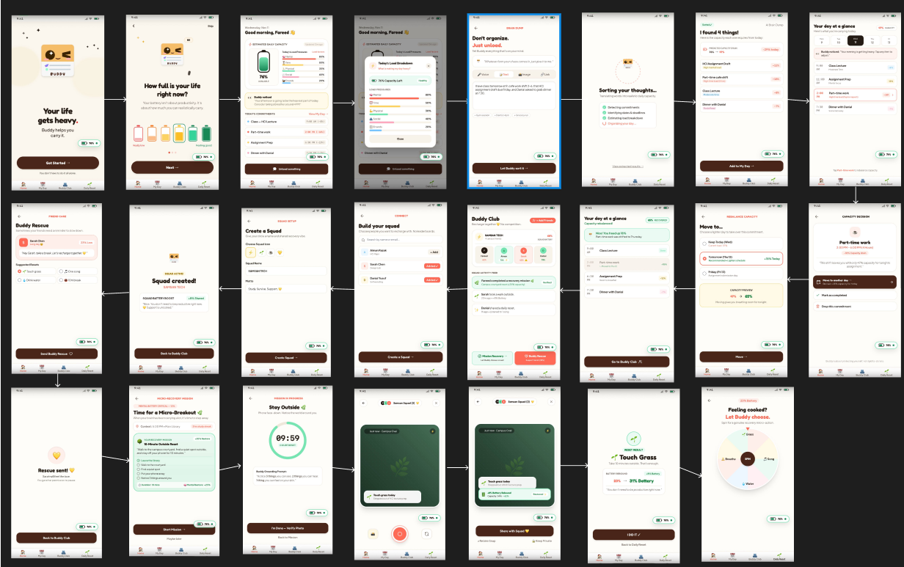

*The final screen flow showing how Buddy evolved into a complete experience from Brain Dump → AI Processing → Capacity → Rebalancing → Buddy Club → Recovery.*

## 2.3 - Mentor Consultation

| Date | Mentor | Feedback Received | What Was Changed |
|---|---|---|---|
| **4/9/2026** | **Faris Imran** | - First consultation focused on our **ideation and mindmap**, not the prototype. - Presented early ideas such as **Brain Dump** and **Face Scanner for Burnout Detection**. - Suggested exploring existing applications to find ideas that could make Buddy more unique and stand out. | - Explored existing productivity and wellness applications. - Developed the **Daily Battery / capacity concept** and five workload dimensions. - Explored social and recovery features to strengthen Buddy's uniqueness. - Later dropped the **Face Scanner** idea due to feasibility and product direction. |
| **8/9/2026** | **Faris Imran** | - Reviewed our **first Buddy prototype**. - Feedback: the prototype lacked **"kick and spice."** - Some parts felt **too draggy** and needed a more engaging experience. | - Explored more interactive features while keeping Buddy recovery-focused. - Developed **Buddy Club, Buddy Rescue, Daily Reset Wheel, recovery activities, and Activity Snap**. - Simplified the main journey to make interactions more direct. |
| **9/9/2026** | **Stephan Khor** | - Presented the **first draft of the Buddy Club prototype**. - Suggested making the interface more **minimalist** because some areas looked compact and crowded. - Suggested changing the Brain Dump upload icon because it could be confusing to users. | - Improved spacing and visual hierarchy. - Reduced unnecessary visual elements to create a cleaner interface. - Refined the Brain Dump upload interaction/icon to make its purpose clearer. |
| **12/9/2026** | **Faris Imran** | - Reviewed the updated prototype. - Suggested improving some design elements, particularly the **colour treatment on Screens 3 and 20**. - Said the prototype was progressing well. - Suggested creating a clear **screen flow** so judges could better understand the prototype. | - Refined colour consistency on the relevant screens. - Organized the prototype into a complete **23-screen flow**. - Structured the journey as **Brain Dump → AI Processing → Capacity → Load Breakdown → Rebalancing → Buddy Club → Recovery**. |
| **13/9/2026** | **Stephan Khor** | - Reviewed our updated Buddy prototype and overall presentation materials. - Suggested improving the **System Architecture Design** so the technical structure and relationship between Buddy's components are clearer. - Encouraged us to refine the architecture before the final submission. - Wished the team **good luck** for the hackathon. | - Improved the **System Architecture Design** to clearly show how the **Mobile App, AI Layer, Capacity Engine, and Buddy features** connect. - Clarified the flow from **Brain Dump → AI Processing → Load Estimation → Daily Capacity → Rebalancing & Recovery**. - Refined the architecture diagram to make the technical implementation easier for judges to understand. |

# 3 - Design & Prototype

## 3. Design & Prototype

UI Prototype

**Public Prototype:** https://buddystudentcompanion.netlify.app/

Key Screens

1) Daily Battery & Load Breakdown — See What You Can Carry

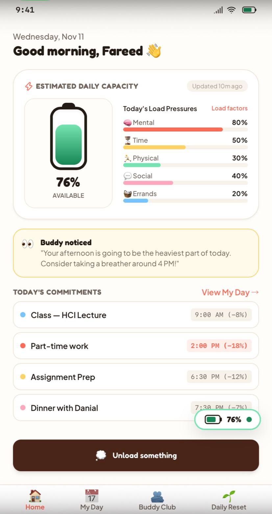

The Daily Battery represents the user's **estimated remaining daily capacity**. Alongside it, Buddy shows five load dimensions — **Mental, Time, Physical, Social, and Errands** — to help users understand what is making their day heavy.

2) Brain Dump — Unload Without Organizing

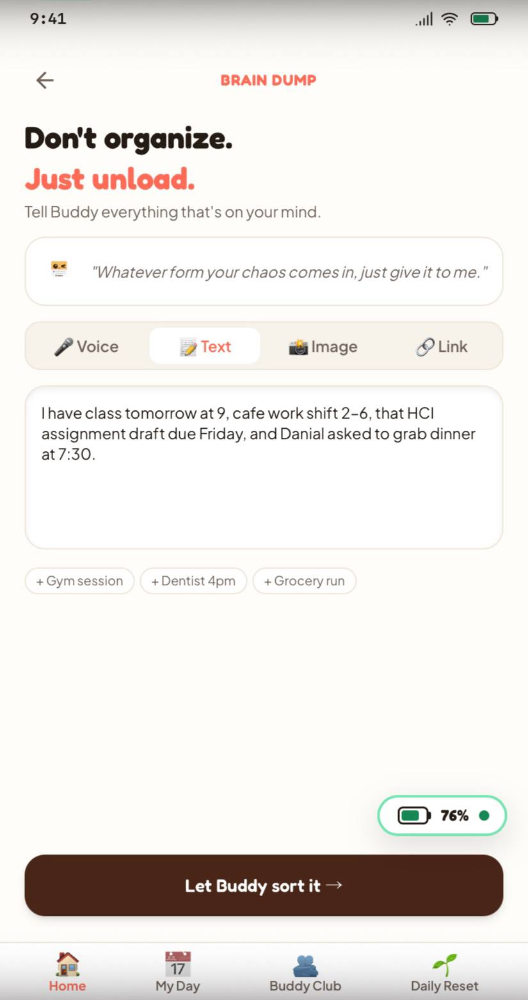

Users can quickly unload what's on their mind through **text, voice, images, or links** without manually organizing everything. Buddy then processes the input to identify relevant commitments and information.

3) Capacity Decision — Decide What to Carry

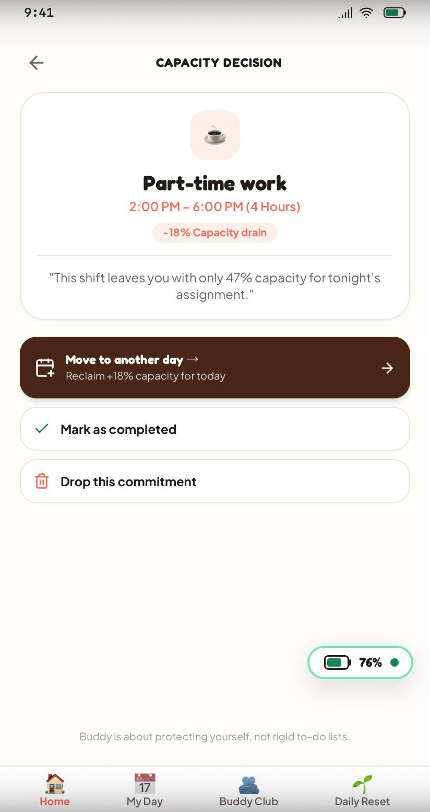

Buddy shows how a commitment affects the user's available capacity and provides clear choices: **move it to another day, mark it as completed, or drop the commitment**. Instead of simply telling users what to do, Buddy helps them decide what they can realistically carry.

4) Rebalance Capacity — Carry Less

When a user's capacity becomes too low, Buddy suggests moving a commitment to a lighter day. A **capacity preview** shows how the decision can improve the user's available capacity before they confirm it.

5) Buddy Club — Recover Together

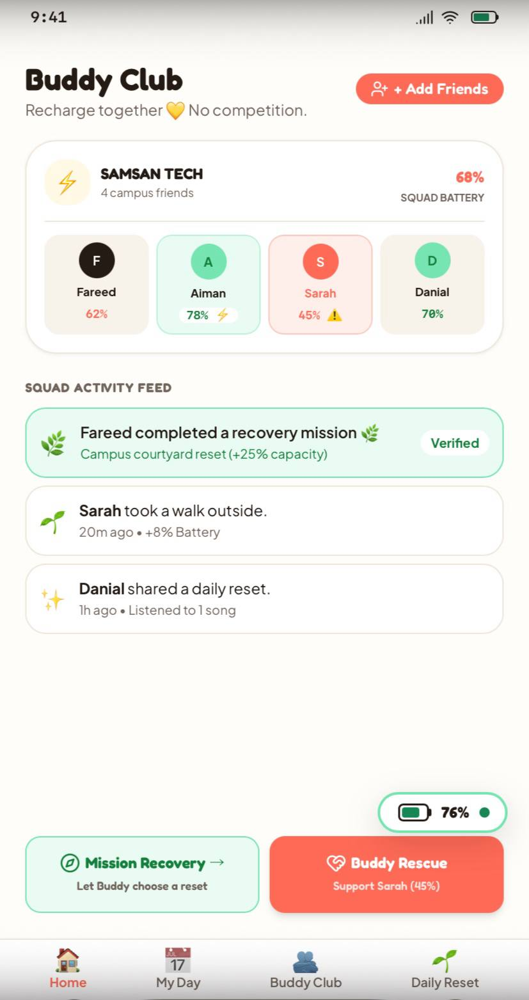

Buddy Club introduces a social recovery layer where friends can share supportive capacity information and recovery activities. Unlike competitive productivity apps, Buddy focuses on **support rather than rankings, streaks, or competition**.

6) Buddy Rescue — Support a Friend

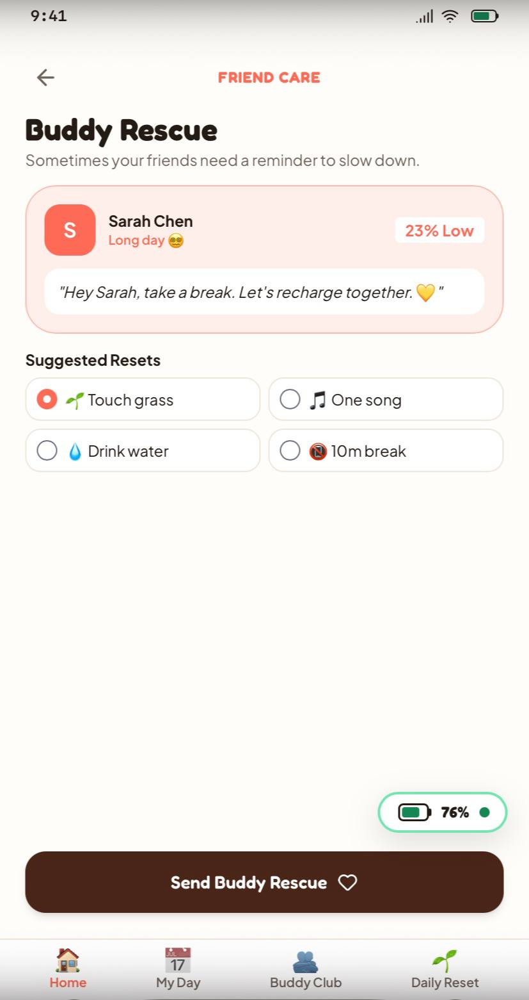

When a friend may be struggling, Buddy Rescue allows users to send a supportive nudge and suggest simple recovery actions such as **touching grass, drinking water, listening to one song, or taking a short break**.

7) Micro-Recovery Mission — Actionable Recovery

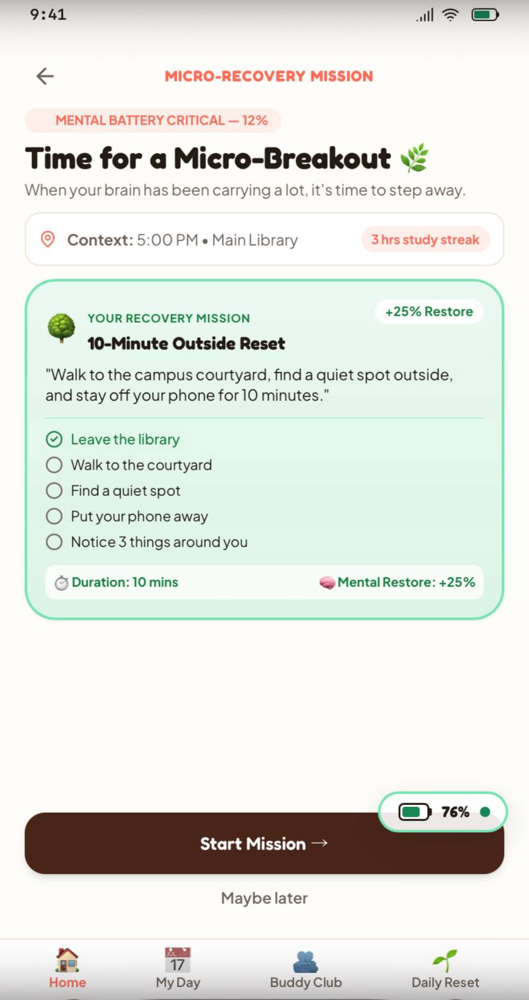

When a particular load area becomes critical, Buddy can suggest a short recovery mission. The example encourages the user to step away from studying and complete a **10-minute outside reset**, turning recovery into a simple and actionable step.

8) Daily Reset — Let Buddy Choose

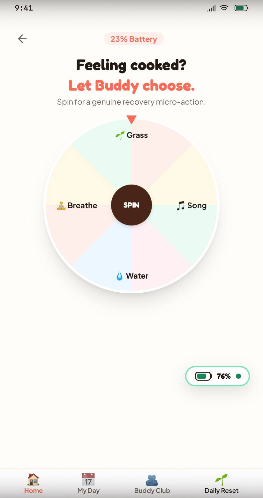

When the user feels overwhelmed, the Daily Reset Wheel provides simple recovery micro-actions such as **Breathe, Grass, Song, and Water**. The feature is designed to make recovery quick and low-effort rather than adding another productivity task.

# 4 - What Makes It Different

1) Multi-Pillar Load vs. Time-Only Planning - Buddy looks beyond schedules by tracking workload across five dimensions: Mental, Time, Physical, Social, and Errands. This helps students understand what is making their day heavy, not just how full their calendar is.
2) Effortless Brain Dump - Instead of manually creating and organizing tasks, users can unload commitments through voice, text, images, or links. Buddy’s AI extracts relevant details such as tasks, dates, deadlines, and estimated workload, reducing the friction of planning.
3) Buddy Rescue: Social Support, Not Competition - Buddy Club lets friends support each other through a shared battery/capacity system. Instead of leaderboards, XP, or productivity streaks that can add pressure, Buddy encourages friends to notice when someone is struggling and send supportive recovery nudges.
4) Actionable Recovery Nudges - Buddy does not stop at showing that a user is overloaded. When capacity becomes low, it suggests realistic actions such as taking a break, delaying a lower-priority commitment, or using the Daily Reset Wheel to recover.

| | Tiimo | Buddy |
|---|---|---|
| **Core Focus** | Planning and organizing daily tasks | **Managing realistic daily capacity** |
| **Main Question** | "What do I need to do?" | **"What can I realistically carry?"** |
| **Workload Awareness** | Primarily schedule and task focused | **Mental, Time, Physical, Social & Errands load** |
| **Task Input** | Task planning and organization | **AI Brain Dump through voice, text, images & links** |
| **When Overloaded** | Helps organize the schedule | **Helps rebalance commitments and recover** |
| **Social Support** | Not the core experience | **Buddy Rescue & Buddy Club** |
| **Recovery** | Not the central mechanic | **Daily Reset + recovery nudges** |

# 5 - Technical Architecture & Feasibility

Tech Stack

| Layer | Technology | Purpose & Why We Chose It |
|---|---|---|
| **Frontend** | Flutter | Used to build Buddy as a cross-platform mobile application for iOS and Android. Flutter allows us to rapidly prototype and maintain a consistent interface across platforms. |
| **Backend API** | FastAPI (Python) | Handles API routing, authentication, business logic, capacity calculations, and communication between the mobile app and external services. FastAPI was chosen for its lightweight structure and fast development. |
| **Database** | Firebase Cloud Firestore | Stores users, commitments, capacity data, recovery activities, and social/squad data. Firestore also supports real-time updates for Buddy Club features. |
| **Authentication** | Firebase Authentication | Provides secure user authentication and account management without requiring us to build authentication infrastructure from scratch. |
| **AI / LLM** | Gemini API | Processes Brain Dump inputs and extracts commitments, dates, times, task categories, and estimated workload from unstructured user input. |
| **Speech-to-Text** | Whisper | Converts voice Brain Dump input into text before it is processed by the AI layer. |
| **OCR / Vision** | Google Vision API | Extracts useful text and information from uploaded images when users use image-based Brain Dump input. |
| **File Storage** | Firebase Cloud Storage | Stores user-uploaded images, voice recordings, and Activity Snapshots. |
| **Notifications** | Firebase Cloud Messaging (FCM) | Supports notifications and Buddy Rescue interactions between users. |

System Architecture Diagram

The architecture follows Buddy's core flow: User Input → AI Processing → Capacity Engine → Recommendation → Buddy Action.

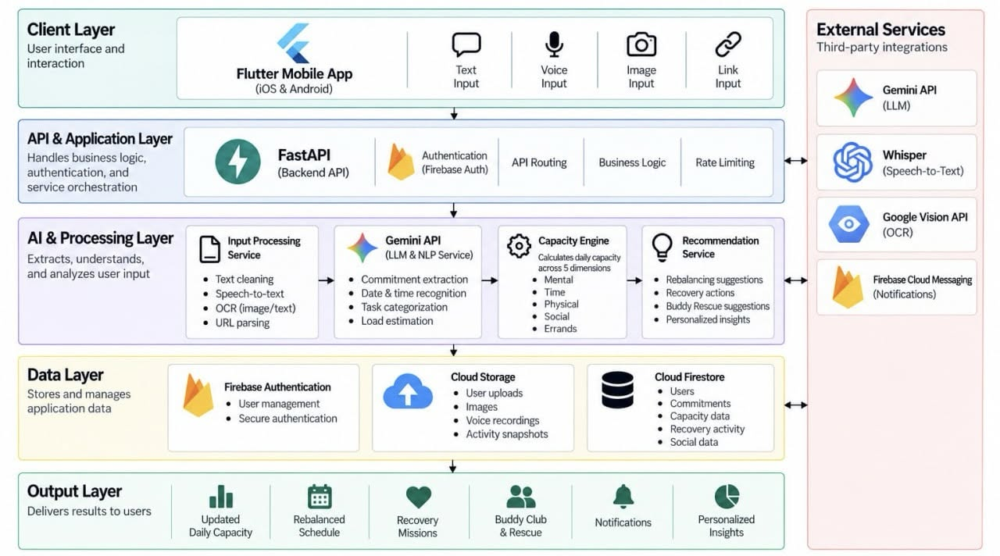

Figure 1. Buddy's system architecture showing how user input is processed through AI services and the Capacity Engine to generate workload, rebalancing, recovery, and social support actions.

Build Plan & Scope

During the building phase, we will focus on a functional MVP that demonstrates Buddy's core anti-burnout loop.

Core Scope
1) Daily Battery Dashboard
  - Display estimated remaining daily capacity.
  - Show the five load dimensions: Mental, Time, Physical, Social, and Errands.
  - Update capacity based on commitments.
2) AI Brain Dump
  - Accept text and voice input.
  - Use Gemini to extract commitments, dates, and estimated workload.
  - Convert unstructured input into structured tasks.
3) My Day & Rebalancing
  - Display commitments in a simple daily timeline.
  - Allow users to move or delay selected commitments.
  - Recalculate estimated remaining capacity after changes.
4) Buddy Club
  - Display squad members and their battery/capacity status.
  - Implement basic Buddy Rescue interactions for supportive check-ins.
5) Recovery
  - Provide simple recovery suggestions when capacity becomes low.
  - Implement the Daily Reset Wheel with lightweight recovery activities.
